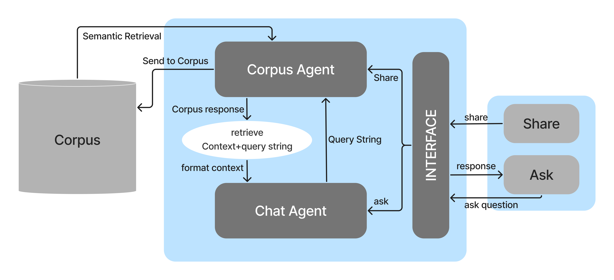

# GemiHub
With inspiration from the evolving trends of smart cities, realtime and relevant information of a targeted region becomes more and more desired and can benefit many people. 
we propose a method that utilizes people and their phones as sources of information - **crowd sourcing**

The messages from all sources are compiled into a central corpus, and when queried utilizes RAG with Gemini 1.5 pro to answer based on relevant information of the targeted region.

By intgrating the interesting mechanism of "Leaving a message at a spot for others to find", and the idea that "If I provide information, I can get information when I want to", the app explores the possibilities of an AI integrated

# DEMO

https://www.youtube.com/watch?v=A9FGS7vpYJI

# structure

# interaction flow

